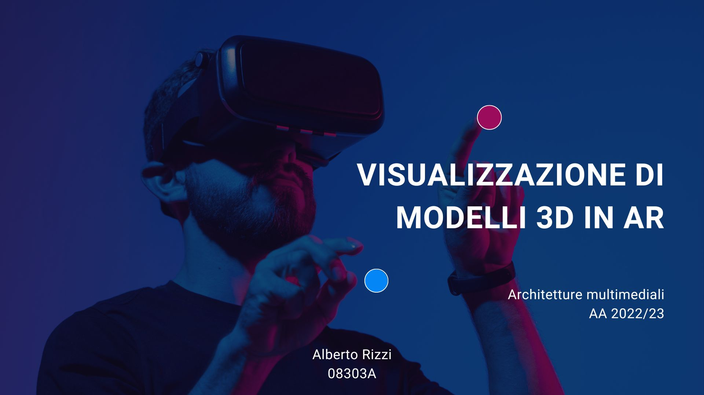

    </img>

___

# Visualizzazione di modelli 3D in AR

    </img>

Utilizzo della librearia React-Three-AR.js per la visualizzazione dei modelli 3D in Realtà Aumentata (AR).

🖥️ [Link presentazione](/presentazione.pdf)